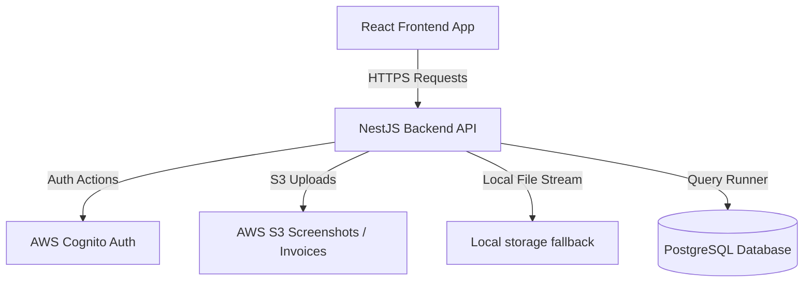
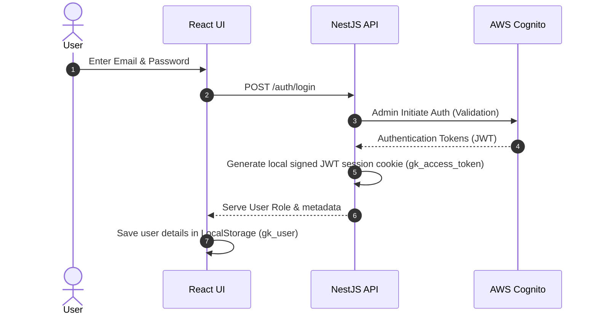
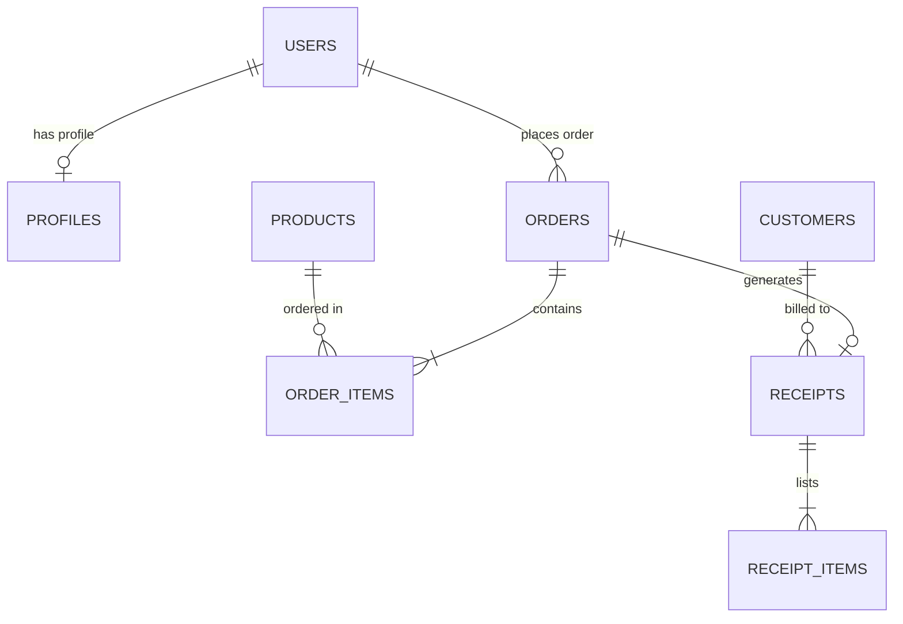

# Architecture Overview

This document details the architectural layers, system relationships, and data flows of the GarageKings system.

---

## 1. High-Level System Architecture
GarageKings operates on a classic Client-Server layout built using lightweight technologies. The backend acts as a monolithic REST API hosting authentication, CRM management, catalog listing, orders, receipts, expenses, splits, and settings.

---

## 2. Authentication Flow
Authentication is built on AWS Cognito with a local cookie-based session token guard.

---

## 3. Database Entity Relationship Model (Subset)

---

## 4. Role & Permission Matrix
The system enforces role permissions at the backend controller level.

| Role | Catalog View | Cart/Checkout | My Profile | Expenses/Splits View | Admin Panel | Catalog Management | Settings Edit |
|---|---|---|---|---|---|---|---|
| **Viewer** | ✅ | ✅ | ✅ | ❌ | ❌ | ❌ | ❌ |
| **Admin** | ✅ | ✅ | ✅ | ✅ | ✅ | ✅ | ❌ |
| **Owner** | ✅ | ✅ | ✅ | ✅ | ✅ | ✅ | ✅ |
