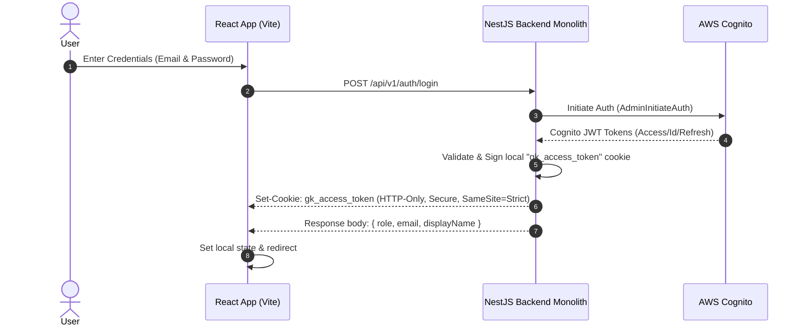

# Authentication & Authorization Protocol

This document details the user authentication flow, session token lifecycle, and role-based access control (RBAC) rules within GarageKings.

---

## 1. Cognito & Local Session Hybrid Model

GarageKings uses a hybrid authentication model combining AWS Cognito for primary credential validation and local JWT cookies for session security:



---

## 2. Session Token Lifecycle

### Local JWT Cookie (`gk_access_token`)
- **HTTP-Only & Secure**: Prevents XSS attacks from reading token payloads.
- **SameSite=Strict**: Mitigates CSRF attacks by ensuring the cookie is only sent on first-party requests.
- **Signature verification**: The backend verifies token signatures using the local JWT private key on every request.

### Token Expiration
- Sessions expire after **15 minutes** (configurable in global settings).
- After expiration, the user is redirected to the login screen `/login`.

---

## 3. Role-Based Access Control (RBAC)

The application defines three roles in the database (`users.role` enum):
1. **`Viewer`**: Standard customer role. Can browse listings, manage carts, submit checkouts, and view personal orders.
2. **`Admin`**: Administrator role. Can manage catalog products, view/confirm orders, record distributor batches, perform cycle counts, and execute manual invoice/billing.
3. **`Owner`**: Master founder role. Inherits all Admin capabilities, plus managing app-wide settings (e.g. founder splits, telemetry config, and database logs).

### Backend Guards
All protected endpoints verify sessions using NestJS Guards:
- `@UseGuards(AuthGuard('jwt'))`: Validates the cookie payload and maps the user record to `req.user`.
- Role verification logic inside controllers:
  ```typescript
  checkAdmin(req: any) {
    const role = req.user.role;
    if (role !== 'Admin' && role !== 'Owner') {
      throw new ForbiddenException('Admin access required.');
    }
  }
  ```
