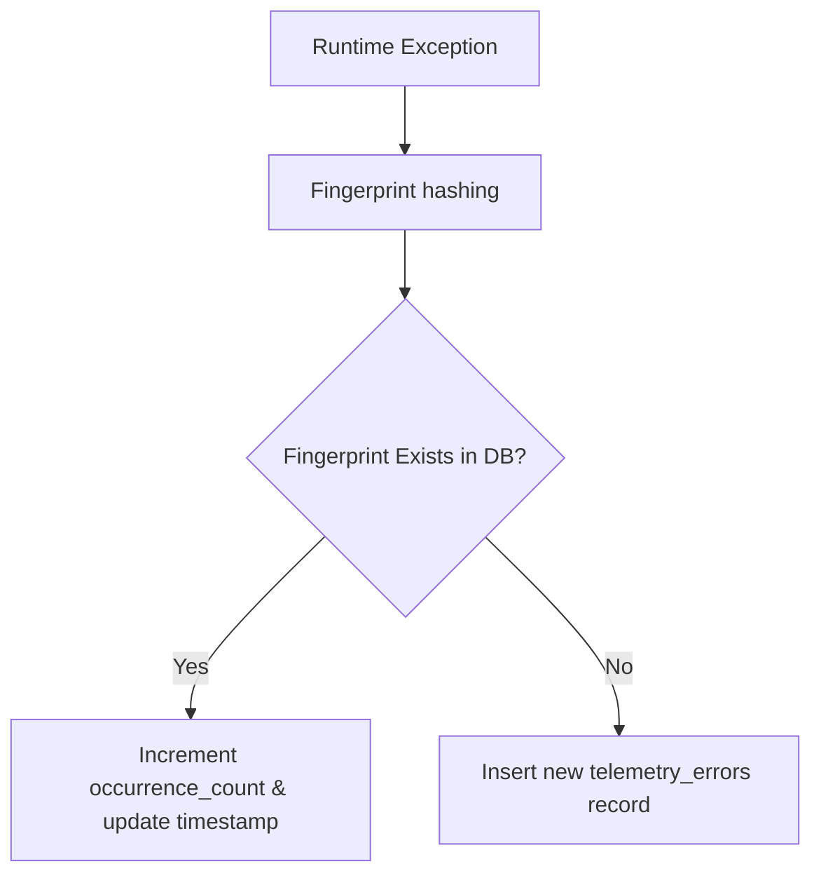

# Observability & Telemetry Framework

This document outlines the logging, error tracking, fingerprinting, and performance metrics systems integrated into the GarageKings platform.

---

## 1. Aggregated Error Tracking & Fingerprinting

To prevent database bloating and provide actionable bug reports, runtime errors are aggregated before storage:

- **Fingerprint Algorithm**: A unique SHA-256 hash is computed using:
  - Error type/source.
  - Message summary.
  - Core stack trace patterns (omitting variable parameters).
- **Logged Metadata**:
  - `route` and `endpoint` where the exception occurred.
  - Browser details (`latest_browser`, `latest_device`).
  - Latest correlation identifier.
  - Payloads and duration stats.

---

## 2. Performance & Latency Metrics

A lightweight interceptor captures performance statistics:
- **Metrics Collected**:
  - `api_latency` (in milliseconds).
  - `query_duration` (for heavy DB operations).
  - Payload sizes.
- **Filtering**: Highly performant telemetry limits overhead to avoid degrading customer checkout operations.

---

## 3. Telemetry Log Inspection

Admins can view errors directly via:
- `GET /api/v1/admin/telemetry/errors`
This endpoints queries the aggregated error trace collection ordered by latest occurrence.
