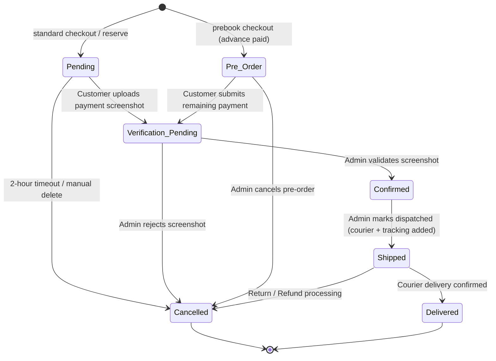

# Order Lifecycle Specification

This document details the states, triggers, transitions, and business implications of the order management system in GarageKings.

---

## 1. High-Level Order State Machine

---

## 2. State Definitions & Business Rules

### Pending
- **Entry Trigger:** Created when a customer checks out via direct purchase.
- **Logic:** Stock is locked (`locked_stock` incremented). An `idempotency_key` is registered.
- **Timeout:** Currently checkout is first-come-first-served. Active timers are disabled, but standard cleanup policy can mark orders as `Expired` / `Cancelled` if payment is not uploaded.

### Verification Pending
- **Entry Trigger:** Triggered when the customer uploads their UPI payment screenshot.
- **Logic:** Available stock remains locked. A system notification is dispatched to administrators for review.
- **Permissions:** Guests (previously) or Customers can upload payment screenshots.

### Confirmed
- **Entry Trigger:** Admin verifies the UPI payment screenshot.
- **Logic:** Stock shifts from `locked_stock` to `sold_stock`. Available inventory count is decremented. Receipts are marked as paid.
- **Invoicing:** A PDF receipt job is queued.

### Pre-Order
- **Entry Trigger:** Created when a customer pre-books an upcoming release.
- **Logic:** The customer pays the `prebook_deposit_amount` (advance). The remaining amount is tracked as `remaining_amount`. Available stock is locked.
- **Completion:** Once remaining payment is submitted, the order moves to `Verification Pending`.

### Shipped & Delivered
- **Shipped:** Requires adding courier details and a tracking number.
- **Delivered:** Final state representing successful arrival.

### Cancelled
- **Logic:** Stock is returned to availability.
  - If previous state was `Confirmed`, `Shipped`, or `Delivered`, `sold_stock` is decremented.
  - If previous state was `Reserved` or `Verification Pending`, `locked_stock` is decremented.
- **Auditing:** All cancellations generate a record in `audit_logs` including previous and updated states.
