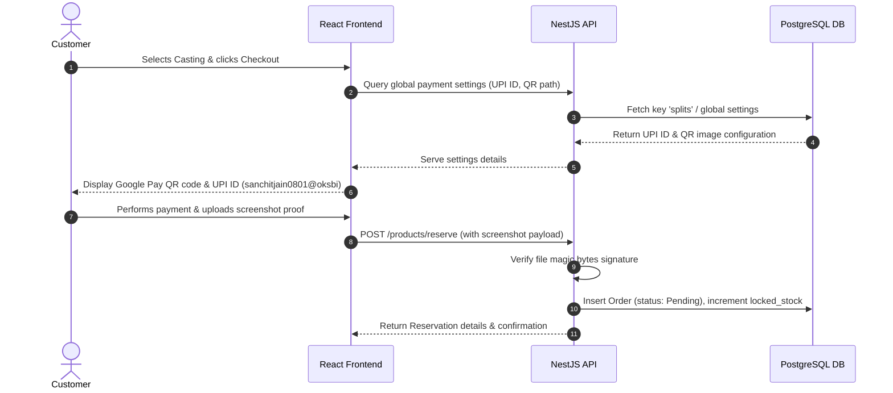

# Payment Verification Workflow Specification

This document details the payment processing steps, UPI settings config, manual verification guidelines, and the OCR/screenshot validation mechanisms.

---

## 1. Checkout Payment Execution Flow

---

## 2. UPI Configuration
- **Active UPI ID:** `sanchitjain0801@oksbi`
- **QR Code Asset:** `/public/upi-qr.png`
- **Settings Store:** Global configurations are retrieved dynamically from the `global_settings` table using the key `companyUpiId` and `upiQrImage`. This allows the owner to change the target UPI payment address from the admin panel without redeploying code.

---

## 3. Manual Screenshot Verification & Security
- **Screenshot Protection:** Payment screenshots are uploaded to a secure folder or private S3 bucket. They are served via an authorized NestJS route `/orders/:id/screenshot` which verifies the user is an Admin, Owner, or the matching Customer before streaming the file.
- **Magic Bytes Verification:** To prevent malware injection, uploaded screenshots must pass signature validation (`validateFileSignature` in `api.helpers.ts`) matching standard jpeg, png, or webp headers.
- **Approval Rule:** When the administrator confirms receipt of funds in the bank account, they flag the order as **Approved** or **Paid**. This triggers:
  1. Transition from `locked_stock` to `sold_stock`.
  2. PDF Receipt generation job entry.
  3. E-commerce order status update.
