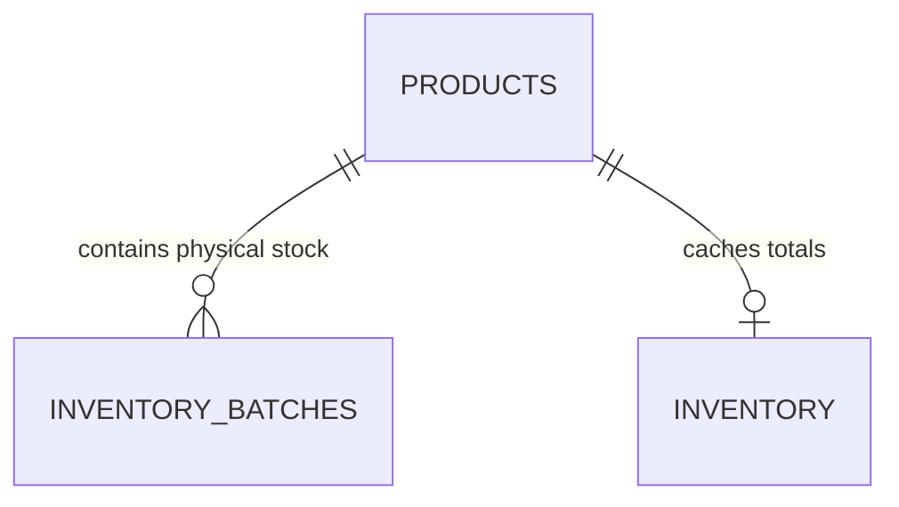

# Product Catalog Specification

This document defines how product castings, catalog listings, and pricing models are designed, normalized, and protected in the GarageKings database.

---

## 1. Product Model & Canonical Identifier (SKU)

The **Stock Keeping Unit (SKU)** is the absolute canonical identifier of a product casting in GarageKings.
- **Rules**:
  1. There is exactly one product record per SKU in the `products` table.
  2. Products must never be matched or merged based on brand, name, series, or color variant.
  3. Spacing, casing, and trailing whitespace in SKUs are normalized (trimmed and upper-cased) upon insertion.

---

## 2. Product Fields & Nullability

The catalog stores core model characteristics. If details are missing from historical sheets, they must stay `NULL` rather than containing placeholder values:
- **`brand`**: Manufacturer casing (e.g. `MINI GT`, `Hot Wheels`, `Inno64`).
- **`series`**: Release series (e.g. `Boulevard`, `Team Transport`). Nullable if mainline.
- **`scale`**: Casting scale (Defaults to `1:64`).
- **`rarity_level`**: Edition variant label (Defaults to `Standard Edition`).
- **`availability_state`**: State enum: `Available`, `Pre-order`.

---

## 3. Product Catalog vs. Inventory Batches

Catalog entries describe *what* a model is, while inventory batches describe *where and how* the physical stock was received:

- A product may have multiple batches, representing stock received from different distributors at different times (with different purchase prices).
- **Price Modification Lock**: Direct editing of base price or purchase price in the `products` table catalog is blocked once inventory batches exist. All subsequent adjustments must be performed by receiving new batches or submitting cycle adjustments, guaranteeing COGS margin accuracy.
