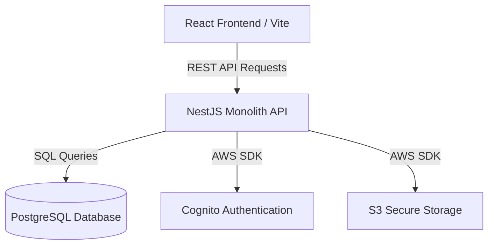

# GarageKings Project Playbook

Welcome to the GarageKings repository. This document serves as the primary architectural and operational contract for the project. Every developer and AI agent must read and comply with this playbook before making changes to the codebase.

---

## 1. Mission & Core Business Goals
GarageKings is a premium e-commerce platform and collector portal for die-cast model cars (Hot Wheels, Matchbox, and high-end grails). The platform facilitates:
1. **The Vault (Marketplace):** Timed product drops and active listing catalogs.
2. **E-commerce Queue (Cart & Checkout):** Direct purchase or pre-booking of limited castings.
3. **Manual Invoice System (Receipts):** In-person billing and custom invoicing.
4. **Founder Ledger (Finances):** Splits, expense logging, and founder settlements.

---

## 2. Overall System Architecture
GarageKings is structured as a full-stack monolith built on modern, lightweight technologies:

- **Frontend:** React SPA built with Vite. UI styled using custom, high-fidelity Tailwind/Vanilla CSS configurations. Zustand and local storage handle cart states and collector authentication cookies.
- **Backend:** NestJS monolithic backend with structured TypeORM data integration. Uses native SQL scripts inside `onModuleInit` to guarantee database schema parity.
- **Infrastructure:** Deployed on AWS Serverless (AWS Lambda, S3, API Gateway, CloudFront).

---

## 3. Directory Layout
- `/src` — Frontend React SPA source code.
- `/src/pages` — Core view templates (Checkout, Admin Dashboard, Marketplace).
- `/src/components` — Modular components (Payment instructions, screenshot uploaders).
- `/src/lib` — Core frontend client libraries (Cognito auth handlers, DB APIs, telemetry).
- `/server` — NestJS Backend API codebase.
- `/server/src/modules/api` — Core product, order, analytics, settings, CMS, and auth endpoints.
- `/server/src/modules/receipts` — Custom invoice generation engine and queue.
- `/server/src/database` — Database initialization SQL (`schema.sql`).
- `/docs` — Permanent product knowledge base and specification system.

---

## 4. Development Principles & Coding Expectations
1. **Never Bypass Backend Validation:** The frontend UI is an interactive layout. All rules, permissions, stock calculations, and type checks must be strictly re-evaluated on the backend server.
2. **Transaction Integrity:** Every multi-step database write (e.g. creating an order, updating inventory, writing an audit log) must be wrapped inside a PostgreSQL Transaction (`BEGIN` ... `COMMIT`/`ROLLBACK`).
3. **Idempotency Locks:** All mutations originating from checkout screens must supply an `idempotency_key` and be checked against the cache or DB to prevent duplicate submissions.
4. **No Placeholders:** Never commit temporary strings or dummy logic. Implement error-handling catch blocks and return friendly messages.

---

## 5. Security Principles
1. **Strict File Upload Validation:** Verify files by reading the byte header (magic numbers), allowing only verified JPEG, PNG, or WEBP formats. Never trust the file extension or MIME type sent by the browser.
2. **Private Assets Protection:** Customer screenshots, payment proofs, and invoices are private documents. They must be stored in private S3 paths or private folder structures, and served via token-validated backend endpoints.
3. **Role-Based Guards:** All admin operations must be explicitly protected with the `@UseGuards(AuthGuard('jwt'))` and verification of the user's role (`Admin` or `Owner`).

---

## 6. Living Documentation Policy
This knowledge base is a **living asset** tied directly to codebase changes.
- If a pull request modifies a business flow (e.g., how orders are processed or drops are scheduled), the corresponding feature contract in `/docs/features/` and the decision log in `/docs/DECISION_LOG.md` must be updated in the same commit.
- AI agents must run a validation check against `docs/BUSINESS_INVARIANTS.md` before finalizing edits.
