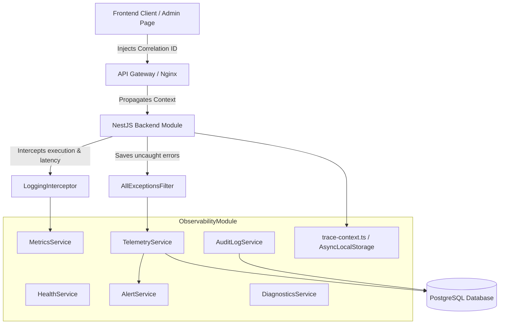

# Observability, Diagnostics, & Audit Logging System

This document outlines the architecture, data flow, features, and setup of the decoupling-first **Observability & Diagnostics System** implemented for GarageKings.

---

## 1. Architectural Blueprint

The system is designed around standard software engineering principles of **loose coupling**, **high cohesion**, and **robust tracing context**.



### Decoupled Core Services
*   **`TelemetryService`**: Handles error ingestion, error fingerprinting, classifier categorization, payload credentials redaction, and database storage.
*   **`AuditLogService`**: Manages secure logs of all state changes, administrative actions, and user interactions.
*   **`MetricsService`**: Captures latency statistics and request payload sizes on all API endpoints.
*   **`HealthService`**: Reports system metrics, database connectivity status, environment runtime, and Git commit revision hashes.
*   **`AlertService`**: Fires alerts when error rates or latencies cross thresholds, and manages log-retention retention policies.
*   **`DiagnosticsService`**: The entry point providing unified diagnostics statistics for the Admin view.

---

## 2. Distributed Tracing & Correlation

Every request traversing the platform receives or propagates a unique **Correlation ID** using standard tracing paradigms.

### Data Flow Lifecycle
1.  **Generation**: The frontend `telemetry.js` module generates a unique Correlation ID on page load: `GK-TR-FE-YYYYMMDD-RANDOM`. This is stored in `sessionStorage` to persist across page refreshes.
2.  **Propagation**: The client REST api wrapper (`db.js`) intercepts all outbound `fetch` calls and automatically attaches this ID as the `x-correlation-id` header.
3.  **Propagation (Async Context)**: The NestJS `TraceMiddleware` intercepts the incoming request, retrieves the header, and stores it in node's `AsyncLocalStorage` (`trace-context.ts`).
4.  **Logging & Exceptions**: If an error is caught in NestJS `AllExceptionsFilter`, the exception details are recorded by `TelemetryService` with the current Correlation ID, and the ID is returned in the API error JSON response for debugging.
5.  **Job Processing**: When an invoice is queued, the correlation ID is attached to the queue record. The async background worker `pdf-worker.js` selects this ID and logs worker events/errors using the same correlation ID.

---

## 3. Redaction & Credential Sanitization

Security is a primary concern. The `TelemetryService` uses recursive sanitization keys to ensure sensitive authentication credentials, passwords, cookies, or CVV codes never get logged in plain text.

```typescript
const REDACTION_KEYS = [
  'password', 'token', 'access_token', 'refresh_token', 
  'secret', 'authorization', 'cookie', 'cvv', 'card', 'pin'
];
```
Any payload dictionary or query argument containing these keys has its value automatically replaced with `[REDACTED]`.

---

## 4. Diagnostics & Diagnostics Views

The system exposes a beautiful **System Health & Observability** dashboard inside the Admin page.

### Admin Dashboard Widgets
*   **System Health Grid**: Displays DB connection status, Git commit hash, free disk space, CPU load, and other health variables returned by `healthService` in a premium bento grid.
*   **Aggregated Error Telemetry**: Searchable list of telemetry errors from `telemetry_errors` table (e.g. error counts, category, message, stack trace, first/last seen, occurrence count) with an "Acknowledge" button.
*   **Searchable Audit Logs**: Table of actions, entity, user, IP, timestamp, correlation ID, with search filters by category and text.
*   **Performance Metrics**: Execution latency, database query time, external HTTP latency with sparklines or simple bars.
*   **Settings Panel**: Tuning alert thresholds and automated log retention cleanup interval.
